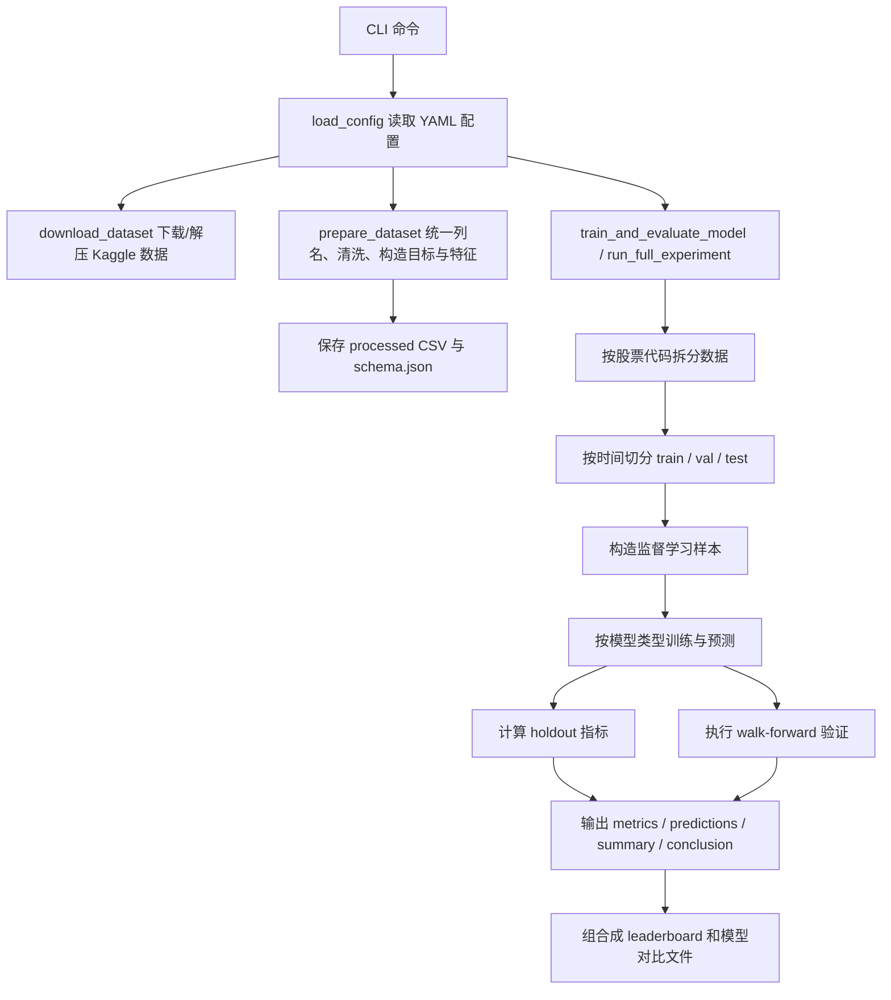

# 股票预测项目代码说明书

## 1. 文档目的与使用方式

本文档面向老师、同学和后续审阅者，目标不是简单介绍“项目做了什么”，而是尽量完整说明：

- 这个仓库当前实现了哪些研究目标；
- 一条实验命令从输入到输出经历了哪些代码流程；
- 每个模块分别负责什么、依赖什么、产出什么；
- 现有实现与 [`report.md`](../report.md) 中的研究计划如何对应；
- 审阅时最容易被问到的问题、限制和后续可扩展点是什么。

建议阅读顺序如下：

1. 先看第 2 节，了解本仓库和 `report.md` 的关系；
2. 再看第 4 节和第 5 节，理解完整执行流程；
3. 然后结合第 6 节到第 10 节查看具体代码实现；
4. 最后看第 11 节到第 13 节，了解输出、测试与当前限制。

---

## 2. 与 `report.md` 的对应关系

`report.md` 是研究/开题层面的说明，强调研究背景、目标、方法与时间安排；本文档是工程实现层面的说明，强调“这些想法在代码里是如何落地的”。

两份文档的对应关系如下：

| `report.md` 章节 | 研究含义 | 代码中的落地点 |
|---|---|---|
| 一、选题背景与意义 | 为什么要做股票价格预测，为什么要比较传统模型与深度模型 | 仓库同时实现 `arima`、`garch_return`、`linear_regression`、`lstm`、`gru`、`transformer`、`arima_residual_lstm` |
| 三、研究目标与任务 | 建立统一实验框架、比较模型、探索混合模型 | [`src/stock_prediction/pipelines/experiment.py`](../src/stock_prediction/pipelines/experiment.py) |
| 四、研究方法 | 统一预处理、统一评价指标、实证比较 | [`src/stock_prediction/data/preprocessing.py`](../src/stock_prediction/data/preprocessing.py)、[`src/stock_prediction/evaluation/metrics.py`](../src/stock_prediction/evaluation/metrics.py) |
| 五、研究内容 5.1 | 数据收集与预处理 | [`src/stock_prediction/data/downloader.py`](../src/stock_prediction/data/downloader.py)、[`src/stock_prediction/data/preprocessing.py`](../src/stock_prediction/data/preprocessing.py) |
| 五、研究内容 5.2 | 基线模型 | [`src/stock_prediction/models/linear_regression.py`](../src/stock_prediction/models/linear_regression.py)、[`src/stock_prediction/models/arima_model.py`](../src/stock_prediction/models/arima_model.py)、[`src/stock_prediction/models/garch_model.py`](../src/stock_prediction/models/garch_model.py) |
| 五、研究内容 5.3 | 深度学习与混合模型 | [`src/stock_prediction/models/neural.py`](../src/stock_prediction/models/neural.py)、[`src/stock_prediction/models/hybrid.py`](../src/stock_prediction/models/hybrid.py) |
| 五、研究内容 5.4 | 模型训练与验证 | [`src/stock_prediction/pipelines/experiment.py`](../src/stock_prediction/pipelines/experiment.py)、[`src/stock_prediction/features/windowing.py`](../src/stock_prediction/features/windowing.py) |
| 五、研究内容 5.5 | 评估指标与比较 | [`src/stock_prediction/evaluation/metrics.py`](../src/stock_prediction/evaluation/metrics.py)、[`src/stock_prediction/evaluation/reporting.py`](../src/stock_prediction/evaluation/reporting.py) |

### 2.1 “同步”应如何理解

这里的“同步”不是要求 `report.md` 和代码说明书文字完全重复，而是要求两者的研究主线一致：

- `report.md` 说明“要研究什么”；
- 本文档说明“现在已经实现到什么程度”；
- 如果未来实验设计、模型范围、评价协议发生变化，应同时更新 `configs/default.yaml`、`README.md`、`report.md` 与本文档中的对应章节。

### 2.2 当前代码相对 `report.md` 的实现状态

当前仓库已经完成了一个较完整的实验框架，重点包括：

- 使用 Kaggle 股票数据集下载与预处理；
- 统一的训练/验证/测试切分与 walk-forward 验证；
- 传统模型、深度模型、混合模型并行对比；
- 自动生成预测结果、指标表、总结文档和图表。

但也要注意，`report.md` 中提到的一些方向仍然属于“研究计划中的扩展项”，例如：

- 更复杂的多模态信息融合；
- 更完整的 GARCH 系列扩展；
- 交易策略级别的回测与收益分析；
- 更细的可解释性分析。

这意味着：当前代码已经能支撑论文中“统一对比框架 + 混合模型探索”的主线，但仍有进一步扩展空间。

---

## 3. 仓库结构总览

当前仓库的核心结构如下：

```text
stock_prediction/
├── configs/
│   └── default.yaml
├── data/
│   ├── raw/
│   ├── interim/
│   └── processed/
├── docs/
│   └── codebase_guide.md
├── outputs/
│   ├── figures/
│   ├── metrics/
│   ├── models/
│   └── predictions/
├── src/stock_prediction/
│   ├── cli/
│   ├── data/
│   ├── evaluation/
│   ├── features/
│   ├── models/
│   ├── pipelines/
│   └── utils/
├── tests/
├── README.md
├── report.md
├── pyproject.toml
└── environment.yml
```

各目录的职责如下：

- `configs/`：集中保存实验配置，当前默认入口是 `configs/default.yaml`。
- `data/raw/`：原始下载数据与解压后的数据。
- `data/interim/`：中间元数据，例如预处理后生成的 `schema.json`。
- `data/processed/`：标准化、清洗后可直接建模的数据文件。
- `outputs/`：实验运行后的所有产物，包括模型文件、指标、预测结果、图表。
- `src/stock_prediction/`：项目主代码。
- `tests/`：针对配置、预处理、特征选择、窗口构造、报告生成等的自动化测试。
- `report.md`：研究报告/开题说明。
- `README.md`：对外入口说明。

---

## 4. 项目整体执行流程

从使用者角度看，标准流程通常是下面三步：

```bash
stock-prediction download-data --config configs/default.yaml
stock-prediction prepare-data --config configs/default.yaml
stock-prediction run-experiment --config configs/default.yaml
```

从代码执行角度看，整体数据流可以概括为：



这条流程的一个重要特点是：**全项目围绕统一实验管线组织，而不是每个模型各写一套独立脚本。**

这样做的好处有两点：

- 所有模型共享相同的数据来源、切分方式、指标与输出规范，实验结果更可比；
- 后续扩展新模型时，只需补充模型类和流水线分支，不需要重写整套实验框架。

---

## 5. 命令行入口与配置加载

### 5.1 CLI 入口

命令行入口位于 [`src/stock_prediction/cli/main.py`](../src/stock_prediction/cli/main.py)。

当前暴露了 5 个命令：

- `download-data`
- `prepare-data`
- `train`
- `evaluate`
- `run-experiment`

其中：

- `download-data` 负责下载与解压；
- `prepare-data` 负责把原始数据整理成统一格式；
- `train` / `evaluate` 实际都会调用同一个训练评估函数；
- `run-experiment` 会遍历多个预测步长和窗口长度，批量生成完整实验结果。

### 5.2 配置对象加载

配置加载位于 [`src/stock_prediction/config.py`](../src/stock_prediction/config.py)。

这个模块的作用不只是“读取 YAML”，还包括：

- 把字符串路径解析为绝对路径；
- 把实验配置组织成 `DatasetConfig`、`ExperimentConfig`、`AppConfig` 三层数据结构；
- 对关键参数做合法性校验。

主要校验包括：

- `train_ratio + val_ratio + test_ratio` 必须等于 1；
- `evaluation_modes` 只能是 `holdout` 或 `walk_forward`；
- `split_mode` 只能是 `date` 或 `ratio`；
- `prediction_horizon`、`window_size`、`window_sizes` 必须为正数；
- `prediction_cutoff` 当前只支持 `close`；
- `backtest_window_type` 当前只支持 `expanding`；
- `winsorize_limits` 必须满足 `0 <= lower < upper <= 1`。

这一步的意义在于：尽量把配置错误在实验开始前就拦截掉，而不是等训练到一半才报错。

### 5.3 当前默认配置的核心含义

默认配置文件是 [`configs/default.yaml`](../configs/default.yaml)，其最关键的设置包括：

- 使用 Kaggle 数据集 `luisandresgarcia/stock-market-prediction`；
- 默认预测目标是 `target_next_adjclose`；
- 默认主价格列是 `adjclose`；
- 默认预测步长矩阵是 `prediction_horizons: [1, 5]`；
- 默认窗口长度矩阵是 `window_sizes: [20, 60]`；
- 默认评估方式同时包含 `holdout` 与 `walk_forward`；
- 默认比较模型包括线性回归、ARIMA、GARCH、LSTM、GRU、Transformer 和 ARIMA-LSTM 混合模型。

可以把它理解为：这个 YAML 文件定义了“本次论文实验的统一规则”。

---

## 6. 数据下载与预处理流程

### 6.1 下载流程

下载逻辑位于 [`src/stock_prediction/data/downloader.py`](../src/stock_prediction/data/downloader.py)。

主要步骤如下：

1. 检查 Kaggle 凭证是否存在；
2. 使用 `KaggleApi` 下载数据压缩包；
3. 将压缩包解压到 `data/raw/stock-market-prediction/`；
4. 返回解压目录路径供后续流程使用。

如果本机没有配置：

- `KAGGLE_USERNAME` 与 `KAGGLE_KEY`，或
- `~/.kaggle/kaggle.json`

则会直接报错，并提示用户手动解压数据集。

### 6.2 预处理入口

预处理入口位于 [`src/stock_prediction/data/preprocessing.py`](../src/stock_prediction/data/preprocessing.py) 的 `prepare_dataset`。

这个函数会把原始 Kaggle 数据转换为标准化后的训练输入。其工作流程如下：

1. 读取解压目录下所有支持的 `csv` / `xlsx` 文件；
2. 针对每个文件自动推断字段语义；
3. 统一列名；
4. 构造时间戳；
5. 数值列强制转为数值类型；
6. 删除非法样本；
7. 生成日历特征与派生收益率/波动率特征；
8. 生成未来目标列；
9. 输出标准化后的 CSV 与特征分组元数据。

### 6.3 字段推断与列名统一

字段推断位于 [`src/stock_prediction/data/schema.py`](../src/stock_prediction/data/schema.py)。

该模块通过 `ALIASES` 定义别名字典，例如：

- `symbol` 可以对应 `ticker`、`company`、`stock`；
- `date` 可以对应 `date`、`timestamp`、`datetime`；
- `adjclose` 可以对应 `adj close`、`adj_close`、`adjusted_close`。

这样做的原因是：真实数据集列名往往不完全一致，统一映射后，后续代码就能始终只依赖标准列名：

- `symbol`
- `date`
- `open`
- `high`
- `low`
- `close`
- `adjclose`
- `volume`

### 6.4 时间戳构造

预处理支持两种时间信息来源：

- 数据本身已有 `date` 列；
- 数据没有单独 `date`，但具有 `year/month/day`，甚至 `hour/minute`。

代码会优先使用已有 `date`，否则拼接时间字段生成标准时间戳。

### 6.5 数据清洗规则

清洗逻辑集中在 `_drop_invalid_rows` 中，主要规则包括：

- `date`、股票标识、价格字段不能为空；
- `volume` 不能为负数；
- `open/high/low/close/adjclose` 必须大于 0；
- `high` 必须不低于 `low`；
- `high` 必须不低于 `open/close/adjclose` 中的最大值；
- `low` 必须不高于 `open/close/adjclose` 中的最小值；
- 同一股票同一日期的重复记录会被删除；
- 股票代码会转为字符串并去除空白。

这些规则的意义是确保后续训练不会被明显错误的数据破坏。

### 6.6 特征构造

预处理阶段会补充两类特征。

第一类是日历特征：

- `feature_year`
- `feature_month`
- `feature_day`
- `feature_day_of_week`
- `feature_is_month_start`
- `feature_is_month_end`
- `feature_hour`
- `feature_minute`

第二类是价格与成交量派生特征：

- `feature_price_return_1`
- `feature_price_return_5`
- `feature_log_return_1`
- `feature_volume_return_1`
- `feature_intraday_return`
- `feature_high_low_spread`
- `feature_rolling_volatility_5`
- `feature_rolling_volatility_10`
- `feature_rolling_mean_return_5`

这些特征是对 `report.md` 中“补充少量收益率、波动率与日历特征”的代码落地。

### 6.7 目标列构造

当前项目默认用“下一期价格”作为监督学习目标。

代码中构造了三个重要目标相关字段：

- `target_next_close`
- `target_next_adjclose`
- `target_date`

其中默认主目标是 `target_next_adjclose`。这与 `configs/default.yaml` 中的：

```yaml
target_column: target_next_adjclose
price_column: adjclose
prediction_horizon: 1
```

直接对应。

如果把 `prediction_horizon` 改成 5，那么目标会变成“未来第 5 个时间点的价格”。

### 6.8 预处理产物

预处理结束后会写出两个关键文件：

- `data/processed/prepared_stock_data.csv`
- `data/interim/schema.json`

其中：

- `prepared_stock_data.csv` 用于后续建模；
- `schema.json` 用于记录标准列、推断结果和特征分组信息，方便审阅与排错。

### 6.9 一个具体例子

假设原始数据中有如下几列：

| date | ticker | close | adjclose | volume |
|---|---|---:|---:|---:|
| 2024-01-01 | AAA | 10.2 | 10.1 | 1000 |
| 2024-01-02 | AAA | 10.6 | 10.5 | 1200 |
| 2024-01-03 | AAA | 10.4 | 10.3 | 900 |

在 `prediction_horizon=1` 时，预处理后会得到类似监督目标：

| feature_date | symbol | current_close | target_date | target_next_adjclose |
|---|---|---:|---|---:|
| 2024-01-01 | AAA | 10.1 | 2024-01-02 | 10.5 |
| 2024-01-02 | AAA | 10.5 | 2024-01-03 | 10.3 |

这表示：用 `2024-01-01` 当天可见的信息，去预测 `2024-01-02` 的调整收盘价。

---

## 7. 特征分组与样本构造

### 7.1 为什么要做特征分组

项目没有把所有数值列无差别喂给所有模型，而是通过 [`src/stock_prediction/features/selection.py`](../src/stock_prediction/features/selection.py) 做特征分组。

这样做有两个原因：

- 不同模型适合的输入形式不同；
- 需要尽量避免目标泄漏和重复无效特征。

### 7.2 特征目录 `FeatureCatalog`

当前主要特征组包括：

- `identity_meta`
- `calendar_features`
- `raw_price_volume`
- `price_returns_volatility`
- `provided_technical_indicators`
- `price_technical_primary`
- `all_numeric_filtered`

其中最常用的是：

- `raw_price_volume`：原始价格与成交量；
- `price_returns_volatility`：收益率与波动率；
- `provided_technical_indicators`：数据集原生技术指标；
- `price_technical_primary`：将以上几类主特征合并后的主力特征集。

### 7.3 自动特征选择规则

特征选择时，代码会排除：

- 目标列本身；
- 含有 `target`、`future`、`lead`、`label` 等泄漏含义的列；
- 缺失率过高的列；
- 唯一值过少的列；
- 内容完全重复的列。

这部分逻辑体现了项目在研究范式上强调的“防止数据泄漏”和“保证可复现性”。

### 7.4 按模型分配默认特征

`default_feature_set_for_model` 的默认策略是：

- `transformer`、`lstm`、`gru`、`arima_residual_lstm` 默认用 `price_technical_primary`；
- 其他模型默认用 `raw_price_volume`。

也就是说，深度模型会看到更丰富的输入特征，而传统单变量统计模型只围绕价格序列本身建模。

---

## 8. 时间切分、监督样本与窗口化

这一部分代码位于 [`src/stock_prediction/features/windowing.py`](../src/stock_prediction/features/windowing.py)。

### 8.1 为什么单独拆出这个模块

时间序列项目里，最容易出问题的地方往往不是模型，而是：

- 数据切分是否泄漏未来信息；
- 验证集和测试集是否使用了错误的上下文；
- 滑动窗口构造是否与目标错位。

因此本项目把这些逻辑集中到一个模块中单独管理。

### 8.2 两种切分方式

项目支持两种切分模式：

- `ratio`：直接按样本比例切分；
- `date`：先基于全局日期边界，再按日期切分每支股票。

默认使用 `date`，原因是它更符合真实金融场景：同一个日期区间应该同时定义训练、验证和测试，而不是每支股票各自独立切开。

### 8.3 监督学习样本构造

`build_supervised_frame` 会把原始时间序列样本转换为监督学习样本，核心字段有：

- `feature_date`：用于构造输入的日期；
- `current_close`：当前时点价格；
- `target_date`：目标日期；
- `target_next_adjclose` 或其他目标列：要预测的未来值。

一个重要细节是：代码会在每个 split 内部重新 `groupby(symbol)` 再做 `shift(-horizon)`，这样可以避免训练集末尾错误地拿到验证集的未来价格作为标签。

这也是测试 `test_build_supervised_split_prevents_cross_boundary_target_leakage` 的重点。

### 8.4 窗口化逻辑

对 LSTM、GRU、Transformer 等序列模型，代码使用滑动窗口把连续样本组织成：

- 输入形状：`(样本数, window_size, 特征维度)`
- 目标形状：`(样本数,)`

如果 `window_size = 20`，就表示每次用最近 20 个时间步的特征序列去预测下一目标值。

### 8.5 为什么验证集和测试集还需要“上下文”

如果验证集第一条样本只看验证集自己，很可能没有足够的 20 步历史。因此项目使用：

- `create_contextual_windows`

让验证集窗口可以借用训练集末尾的上下文，测试集则可以借用训练集和验证集末尾的上下文。

这并不是泄漏，因为这些上下文在预测时已经发生过，属于可观测历史。

### 8.6 标准化与 winsorize

`scale_and_window` 会做两件关键事：

1. 仅用训练集统计量进行特征缩放；
2. 仅用训练集分位数边界做 winsorize 截尾，再把同样边界应用到验证/测试集。

这保证了：

- 不会把验证集和测试集分布提前泄漏给训练过程；
- 极端值不会过度拉扯特征尺度。

---

## 9. 模型实现与训练逻辑

### 9.1 模型工厂

模型统一由 [`src/stock_prediction/models/factory.py`](../src/stock_prediction/models/factory.py) 创建。

它的作用是把字符串模型名映射为具体模型对象，例如：

- `linear_regression`
- `linear_regression_scaled`
- `arima`
- `garch_return`
- `lstm`
- `gru`
- `transformer`
- `arima_residual_lstm`

统一工厂的好处是：主实验流水线只需要关心“我要什么模型”，不用关心每个模型类如何初始化。

### 9.2 线性回归基线

实现位于 [`src/stock_prediction/models/linear_regression.py`](../src/stock_prediction/models/linear_regression.py)。

当前有两种版本：

- `linear_regression`
- `linear_regression_scaled`

后者通过 `sklearn.pipeline + StandardScaler` 先做缩放再回归。

它们的角色主要是：

- 作为最容易解释的表格型基线；
- 检验在技术指标输入下，简单线性模型能达到什么水平。

### 9.3 ARIMA 模型

实现位于 [`src/stock_prediction/models/arima_model.py`](../src/stock_prediction/models/arima_model.py)。

它是典型的单变量时间序列模型：

- 输入本质上只需要价格序列；
- 通过 `statsmodels` 的 ARIMA 拟合；
- 预测时按未来步数输出 forecast。

在实验中，ARIMA 还有一个额外作用：为混合模型提供线性预测基线与残差信号。

### 9.4 GARCH 收益率模型

实现位于 [`src/stock_prediction/models/garch_model.py`](../src/stock_prediction/models/garch_model.py)。

这里的实现逻辑不是直接预测价格，而是：

1. 把价格转换为对数收益率；
2. 用 GARCH 建模收益率条件波动；
3. 预测下一步收益率；
4. 再映射回下一步价格。

因此它更适合解释为“收益率驱动的价格预测基线”。

### 9.5 LSTM 与 GRU

实现位于 [`src/stock_prediction/models/neural.py`](../src/stock_prediction/models/neural.py)。

这两个模型共享同一套 `_SequenceRegressor` 框架，差别主要在循环单元：

- LSTM：门控更复杂，更适合长期依赖；
- GRU：参数更少，训练更轻量。

代码中还实现了：

- 批量训练；
- `Adam` 优化器；
- 基于验证集损失的 early stopping；
- 记录每个 epoch 的训练历史。

### 9.6 Transformer

同样位于 [`src/stock_prediction/models/neural.py`](../src/stock_prediction/models/neural.py)。

它采用的是编码器式结构：

- 先把输入特征投影到隐藏空间；
- 再经过若干层 `TransformerEncoder`；
- 取最后一个时间步的编码结果做回归输出。

这里并没有实现特别复杂的时间编码或多分支结构，属于一个清晰、可复现的 Transformer 基线版本。

### 9.7 ARIMA 残差 LSTM 混合模型

实现位于 [`src/stock_prediction/models/hybrid.py`](../src/stock_prediction/models/hybrid.py)。

这是当前项目最贴近 `report.md` 中“混合预测框架”主线的模型，基本思想是：

1. 先用 ARIMA 学习价格序列中的线性部分；
2. 计算 ARIMA 对当前价格的拟合残差；
3. 再用 LSTM 学习这些残差及相关特征中的非线性部分；
4. 最终预测值 = `ARIMA 线性预测 + LSTM 残差预测`。

这类设计的研究意义在于：

- ARIMA 保留统计建模的可解释线性结构；
- LSTM 补充非线性表达能力；
- 两者叠加比单独使用任一模型更符合论文中的“互补建模”思路。

---

## 10. 实验流水线详解

主实验逻辑位于 [`src/stock_prediction/pipelines/experiment.py`](../src/stock_prediction/pipelines/experiment.py)，这是全项目最核心的文件。

### 10.1 该模块负责什么

它负责把前面所有模块串起来，完成：

- 读取准备好的数据；
- 选择股票代码；
- 按时间切分；
- 按模型类型选择不同训练流程；
- 生成 holdout 结果；
- 生成 walk-forward 结果；
- 保存模型与各类输出文件。

### 10.2 读取准备数据

`_load_prepared_frame` 会读取 `prepared_stock_data.csv`，并保证：

- `date` 解析为时间类型；
- 如果缺少 `feature_date` / `target_date`，则补齐；
- 为后续按 horizon 构造样本提供统一输入。

### 10.3 按股票代码独立实验

`train_and_evaluate_model` 会先筛选股票代码，再逐个 `symbol` 循环建模。

这样做的含义是：

- 每支股票单独训练和评估；
- 最终再把所有股票的指标聚合成模型层面的结果。

这也解释了为什么输出文件中会同时出现：

- 单个样本预测结果；
- 按股票聚合后的指标结果；
- 按模型再聚合的 summary/conclusion。

### 10.4 holdout 评估协议

holdout 的逻辑并不是简单的“train 一次，直接 test”，而是：

1. 用训练集训练；
2. 在验证集上进行模型选择或 early stopping；
3. 用训练集 + 验证集重新拟合最终模型；
4. 再在测试集上生成最终 holdout 预测。

这个流程使深度模型的训练轮数、ARIMA/GARCH 的候选参数都能够借助验证集完成选择。

### 10.5 不同模型的分支

在 `train_and_evaluate_model` 中，不同模型走不同分支：

- 线性回归：表格型特征直接回归；
- ARIMA：单变量价格序列；
- GARCH：收益率建模后转回价格预测；
- LSTM/GRU/Transformer：窗口化序列输入；
- `arima_residual_lstm`：先做 ARIMA，再做残差序列学习。

这说明项目虽然使用统一框架，但并没有强行把所有模型塞成同一种输入格式，而是保留了各模型合理的训练方式。

### 10.6 ARIMA / GARCH 的参数选择

如果 `tune_arima_order: true`，代码会：

- 枚举 `arima.order_grid`；
- 用验证集 RMSE 选择最优 ARIMA 阶数；
- GARCH 也会对 `order_grid` 做类似选择。

对应记录会写入训练日志中，便于审阅者追溯“为什么选了这个参数”。

### 10.7 深度模型的 early stopping

对 `lstm`、`gru`、`transformer` 和混合模型中的残差网络，代码会：

- 记录每轮 `train_loss` 和 `val_loss`；
- 在验证损失没有继续改善时减少 patience；
- 停止后保留最佳参数状态；
- refit 阶段使用最佳 epoch 数重新训练。

这是一种比较标准、也比较适合论文实验的训练控制方式。

### 10.8 walk-forward 评估协议

walk-forward 用于模拟真实外推场景。当前实现是 expanding window：

- 第 1 步：用已有历史预测测试集第 1 个样本；
- 第 2 步：把第 1 个测试样本纳入历史，再预测第 2 个样本；
- 第 3 步：继续扩展历史，预测第 3 个样本；
- 以此类推。

这种方式比单次 holdout 更能体现模型在真实时间推进中的稳定性。

### 10.9 一个 walk-forward 例子

假设测试区间有 3 个样本：`t1`、`t2`、`t3`。

那么 walk-forward 过程是：

1. 用训练集 + 验证集预测 `t1`；
2. 把 `t1` 的真实值并入历史，再预测 `t2`；
3. 把 `t2` 并入历史，再预测 `t3`。

其核心思想是：每一步预测时，只允许使用当时已经发生的历史数据。

### 10.10 全量实验矩阵

`run_full_experiment` 会遍历：

- `prediction_horizons`
- `window_sizes`
- `selected_models`

于是会形成一个实验矩阵，例如默认配置下相当于：

- 2 个 horizon：1、5
- 2 个 window：20、60
- 8 个模型

总共形成多个实验组合，并统一汇总为 leaderboard。

---

## 11. 评估指标、报告与输出文件

### 11.1 指标计算

指标计算位于 [`src/stock_prediction/evaluation/metrics.py`](../src/stock_prediction/evaluation/metrics.py)。

当前核心指标包括：

- `RMSE`
- `MAE`
- `SMAPE`
- `DA`（directional accuracy，方向准确率）
- `Up/Down Precision`
- `Up/Down Recall`
- `Up/Down F1`

其中 `DA` 的计算逻辑是：比较预测价格相对于当前价格的涨跌方向，是否与真实涨跌方向一致。`Up/Down Precision/Recall/F1` 则进一步把“上涨”和“下跌”分别视为 one-vs-rest 分类任务，用来描述模型对涨跌判断能力的细分表现。`MSE` 仍可保留在底层结果 CSV 中作为兼容字段，但不再作为最终指标说明的重点。

### 11.2 报告生成

报告生成位于 [`src/stock_prediction/evaluation/reporting.py`](../src/stock_prediction/evaluation/reporting.py)。

该模块会输出：

- 原始指标 CSV；
- 原始预测 CSV；
- 训练日志 CSV；
- 汇总 Markdown；
- 结论 Markdown；
- 模型对比 CSV；
- 可视化图表。

### 11.3 输出目录说明

主要输出文件类型如下：

| 目录 | 内容 |
|---|---|
| `outputs/models/` | 序列化保存的模型文件 |
| `outputs/predictions/` | 每个模型的预测结果，以及模型间对比文件 |
| `outputs/metrics/` | 指标、summary、conclusion、training log、leaderboard |
| `outputs/figures/` | 条形图、best/worst 图、walk-forward 误差图 |

### 11.4 `summary.md` 和 `conclusion.md` 的区别

- `summary.md` 偏“结果表”，会给出详细指标和聚合表；
- `conclusion.md` 偏“文字结论”，会自动写出“哪个模型最好、holdout 与 walk-forward 是否一致、hybrid 相对 ARIMA 的平均改变量”等。

因此：

- `summary.md` 更适合查数据；
- `conclusion.md` 更适合直接放到论文分析材料里做参考。

### 11.5 模型对比文件

`build_model_comparison_frame` 会把多个模型在同一批样本上的预测结果拼接到一张表中，例如：

- `pred_arima`
- `pred_lstm`
- `pred_transformer`

并额外标记：

- `is_extreme_volatility`
- `event_id`

这一步方便后续做“同一事件下不同模型表现”的横向比较。

---

## 12. 关键模块逐文件说明

为了便于老师和审阅者快速定位，这里把核心文件再次按职责总结如下。

### 12.1 配置与入口

- [`src/stock_prediction/cli/main.py`](../src/stock_prediction/cli/main.py)：命令行入口。
- [`src/stock_prediction/config.py`](../src/stock_prediction/config.py)：配置解析与参数校验。

### 12.2 数据层

- [`src/stock_prediction/data/downloader.py`](../src/stock_prediction/data/downloader.py)：Kaggle 下载与解压。
- [`src/stock_prediction/data/schema.py`](../src/stock_prediction/data/schema.py)：字段别名推断。
- [`src/stock_prediction/data/preprocessing.py`](../src/stock_prediction/data/preprocessing.py)：标准化、清洗、特征构造、目标构造、schema 输出。

### 12.3 特征与样本层

- [`src/stock_prediction/features/selection.py`](../src/stock_prediction/features/selection.py)：特征分组、泄漏过滤、默认特征集策略。
- [`src/stock_prediction/features/windowing.py`](../src/stock_prediction/features/windowing.py)：时间切分、监督样本构造、滑动窗口、标准化与上下文窗口。

### 12.4 模型层

- [`src/stock_prediction/models/base.py`](../src/stock_prediction/models/base.py)：统一模型接口。
- [`src/stock_prediction/models/factory.py`](../src/stock_prediction/models/factory.py)：模型工厂。
- [`src/stock_prediction/models/linear_regression.py`](../src/stock_prediction/models/linear_regression.py)：线性基线。
- [`src/stock_prediction/models/arima_model.py`](../src/stock_prediction/models/arima_model.py)：ARIMA。
- [`src/stock_prediction/models/garch_model.py`](../src/stock_prediction/models/garch_model.py)：GARCH 收益率模型。
- [`src/stock_prediction/models/neural.py`](../src/stock_prediction/models/neural.py)：LSTM、GRU、Transformer。
- [`src/stock_prediction/models/hybrid.py`](../src/stock_prediction/models/hybrid.py)：ARIMA 残差 LSTM 混合模型。

### 12.5 实验与评估层

- [`src/stock_prediction/pipelines/experiment.py`](../src/stock_prediction/pipelines/experiment.py)：总实验流水线。
- [`src/stock_prediction/evaluation/metrics.py`](../src/stock_prediction/evaluation/metrics.py)：误差指标。
- [`src/stock_prediction/evaluation/reporting.py`](../src/stock_prediction/evaluation/reporting.py)：结果文件与图表生成。

### 12.6 工具层

- [`src/stock_prediction/utils/dependencies.py`](../src/stock_prediction/utils/dependencies.py)：依赖按需导入与错误提示。
- [`src/stock_prediction/utils/io.py`](../src/stock_prediction/utils/io.py)：目录创建、JSON 读写。

---

## 13. 测试体系与质量控制

测试位于 [`tests/`](../tests) 目录。

当前测试覆盖的重点不是“每个模型一定能训练到最好”，而是“整个实验框架的关键机制是否正确”。

### 13.1 当前已有测试覆盖点

| 测试文件 | 主要验证内容 |
|---|---|
| [`tests/test_config.py`](../tests/test_config.py) | 默认配置是否正确解析 |
| [`tests/test_schema.py`](../tests/test_schema.py) | 字段别名推断是否可靠 |
| [`tests/test_preprocessing.py`](../tests/test_preprocessing.py) | 预处理后是否生成目标列、特征列和 schema |
| [`tests/test_feature_selection.py`](../tests/test_feature_selection.py) | 特征分组是否符合预期 |
| [`tests/test_windowing.py`](../tests/test_windowing.py) | 窗口化、时间切分、目标对齐、防泄漏逻辑 |
| [`tests/test_experiment_pipeline.py`](../tests/test_experiment_pipeline.py) | hybrid 特征列和日期边界逻辑 |
| [`tests/test_reporting.py`](../tests/test_reporting.py) | summary / conclusion / 模型对比输出 |
| [`tests/test_models.py`](../tests/test_models.py) | 模型工厂能否构造 Transformer 与 GARCH |

### 13.2 这些测试说明了什么

它们说明项目当前比较重视以下工程质量点：

- 配置正确性；
- 预处理鲁棒性；
- 时间序列防泄漏；
- 输出文档可生成；
- 模型入口一致性。

### 13.3 当前测试尚未完全覆盖的地方

以下部分仍可继续加强：

- 对完整 `run-experiment` 的集成测试；
- 对真实 Kaggle 数据样本的回归测试；
- 对图表生成内容的更细验证；
- 对深度模型训练稳定性的更多测试；
- 对模型保存/加载后的结果一致性测试。

---

## 14. 审阅时可能会被问到的问题

### 14.1 为什么默认预测 `adjclose` 而不是 `close`

因为 `adjclose` 会考虑分红、拆股等调整，通常更适合作为研究中相对稳定的价格序列。当前代码同时保留了 `target_next_close`，便于后续比较。

### 14.2 为什么既做 holdout，又做 walk-forward

因为单次 holdout 更适合快速比较模型，而 walk-forward 更接近真实时间推进场景。两者一起使用，可以同时看“静态对比表现”和“动态外推稳定性”。

### 14.3 为什么要加入混合模型

这是为了对应 `report.md` 中“统计模型与深度模型具有互补性”的研究主线。ARIMA 负责线性部分，LSTM 负责残差非线性部分，是一个相对容易解释、也容易实证验证的混合方案。

### 14.4 为什么不直接用所有特征训练所有模型

因为不同模型适合的输入结构不同，而且盲目加入全部数值列容易带来冗余、噪声和泄漏风险。项目通过特征目录和默认特征集机制控制这一点。

### 14.5 为什么序列模型要先在验证集上选 epoch，再用 train+val 重新训练

因为这是一种比较规范的实验协议：验证集负责选择训练轮数，最终模型再用更多历史数据重训，以便获得更公平的测试结果。

---

## 15. 当前限制与后续可扩展方向

### 15.1 当前限制

当前实现存在以下边界：

- 数据源主要围绕 Kaggle 的价格与技术指标数据；
- 没有真正纳入新闻、情绪、宏观变量等外部多模态数据；
- Transformer 是基线版实现，不包含更复杂的金融时间编码设计；
- GARCH 是收益率预测型基线，并未覆盖更完整的波动率建模家族；
- 指标主要是误差类指标，尚未扩展到收益率、夏普比率、最大回撤等交易层面评价。

### 15.2 后续扩展方向

如果后续老师希望继续扩展，这个仓库较自然的方向包括：

1. 加入更多市场或外生变量。
2. 增加更复杂的混合模型与注意力机制。
3. 增加策略回测与交易可行性分析。
4. 补充可解释性分析，例如特征重要性或事件窗口分析。
5. 增强自动化实验记录，例如保存更多超参数、随机种子与版本信息。

---

## 16. 总结

从工程角度看，这个项目已经不是“单个模型脚本”，而是一套围绕论文研究问题组织起来的统一实验框架。

它当前最值得强调的特点有四点：

- 预处理、切分、评估和输出流程统一；
- 同时支持传统统计模型、深度模型与混合模型；
- 明确考虑了时间序列防泄漏问题；
- 可以自动生成适合论文分析的指标、图表和结论文档。

如果把 `report.md` 看作“研究目标说明书”，那么本文档就是“代码落地说明书”。二者结合后，审阅者既能看到研究设计，也能看到这些设计在代码中如何被具体实现。
